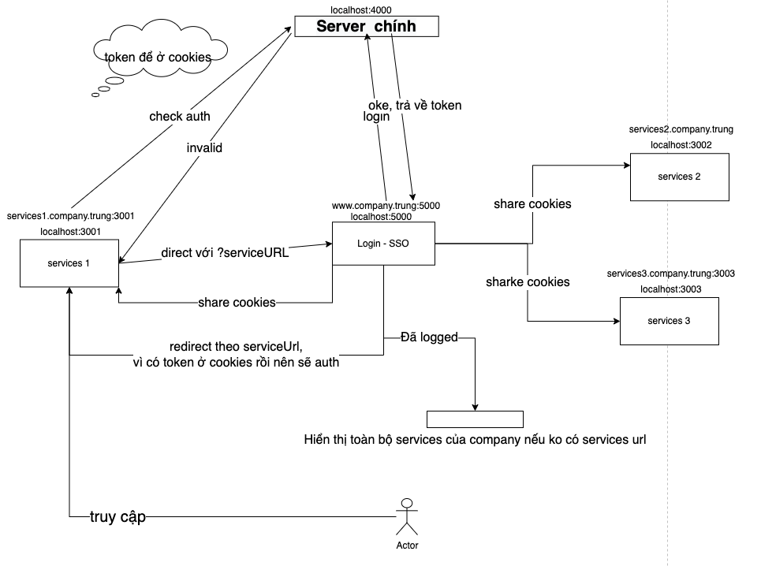

# SSO-Demo

## Vấn đề

Một công ty `company` có rất nhiều dịch vụ vd `service1`,`service2`,`service3`
việc nhớ hết tài khoản mật khẩu của các dịch vụ này thì rất là mệt. <br/>

**_Mong muốn_** : Có một trang đăng nhập chung cho tất cả các services của công ty `company` <br/>

=> Từ đó SSO ra đời dựa trên cơ chế cùng origin thì share cookies <br/>

## Props and Cons

Props:

- Giảm số lượng username và password người dùng phải nhớ.
- Giảm số lượng login vào các dịch vụ.
- Phân quyền

<br/>

Cons: 
<br/>

* Tốn chi phi để chạy SSO server .
* Native app không dùng đc.

## Mechanism

#### Share cookies

\***\*Chú ý:\*\*** Khi set cookies để ý thuộc tính domain. phải setdomain cho đúng.

Một domain `company.com` các subdomain của nó sẽ là `xxx.xxx.company.com` tường minh hơn
` service1.company.com`,
` service2.company.com`,
` service3.company.com`,
Và `differnent-company.com` không phải nên nó sẽ ko share domain.

#### Luồng hoạt động

Các domain sẽ dùng: <br/>

```bash
# sso-login
http://company.trung:5000

http://service.diffent-company.trung:3000

http://service1.company.trung:3001
http://service2.company.trung:3002
http://service3.company.trung:3003

```

#### Luồng

người dùng ->service1 -> chưa auth (cookies ko có or token hết hạn) -direct tới sso-login với params serviceURL -> sso-login; </br>

người dùng nhập username/pass ở sso-login -> server sẽ auth và trả về token-> lưu token vào `cookies` . Các domain con sẽ dc share cookies từ domain trang login.
sso-login redirect về lại theo serviceURL. <br/>

**_Nếu ko có serviceURL:_** Hiển thị danh sách các servíces có thể chọn. </br>

Vi đã đc share cookies nên các service 2 ,3 có thể vào mà không cần đăng nhập.

Nếu vào ` diffent-company.trung:3000` sẽ không vào đc vì ko đc share cookies </br>

Vì server backend có list các origin, nên các orign cùng subdomain mà ko thuộc list trên BE thì sẽ bị lỗi CORS. <br/>

###### Logout

Nếu một trong các domain xoá token thì các domain còn lại sẽ bị xoá token. Phải đăng nhập lại lần đầu. <br />



## Cách chạy demo.

- `git clone .....` project về
- `cd ....` vào các folder để tải cái packages.
- Sửa lại file host ở máy cá nhân
  Dòng `MacOS` or `Ubuntu` nằm ở `/etc/hosts`. <br/>

```bash
# demo sso

127.0.0.1  company.trung
127.0.0.1  service.diffent-company.trung
127.0.0.1  service1.company.trung
127.0.0.1  service2.company.trung
127.0.0.1  service3.company.trung

```

- start các services ở mỗi folder.

**_Chú ý_**

- Demo nên việc authen diễn ra đơn giản ko cần phải lưu ở db. <br>

```js
//  list tài khoản được đặt ở file
// ./server/ListAccount.js
const ListAccount = [
  {
    id: 1,
    name: "trung",
    username: "trungdq1",
    password: "trungdq1",
    age: 12,
  },
  // .....
];
```

- set cookies phải có thuộc tính domain ví dụ:

```bash
document.cookie="user_id=1295214458; Path=/; Domain=.company.trung;"
```

- axios ko cho gửi cookies lên phải gửi tạm qua setcookie, Authentication

<a href="https://codeburst.io/building-a-simple-single-sign-on-sso-server-and-solution-from-scratch-in-node-js-ea6ee5fdf340">Reference </a>
